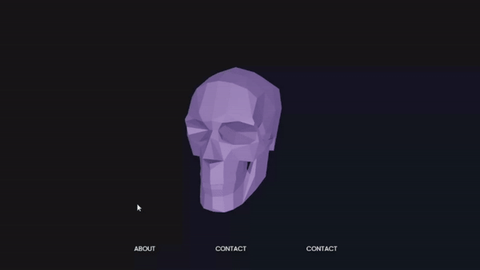

<div align='center'>

# 3D Object Follows Cursor


   


</div>


<div align="center">
    
</div>


In this case I tried to add three sections formed by :

src/constants/index.js

```js 
export const BUTTONS_DATA = [
    { id: 1, label: 'CONTACT' },
  ];


  export const DIVS_DATA = [
    { id: 1, label: 'ABOUT' },
  ];

  export const PROJECTS_DATA = [
    { id: 1, label: 'CONTACT' },
  ];
```
and Hero.jsx:

```js
        <div className="section2">
          {PROJECTS_DATA.map((button, index) => {
            const { x, y } = calculateButtonPosition(index, PROJECTS_DATA.length);
            return (
              <button
                className="button"
                key={button.id}
                onClick={() => alert(`${button.label} clicked`)}
                onMouseEnter={handleMouseEnter}
                onMouseLeave={handleMouseLeave}
              >
                {button.label}
              </button>
            );
          })}
        </div>
```

The Skull is not going to keep following the cursor when it hovers over this 'className="section{x}"'

That's why I used:

```onMouseEnter={handleMouseEnter}```

```onMouseLeave={handleMouseLeave}```

 In this case when cursor hovers this sections, the 3D object will reset to the 0,0,0 position:

  ```js

    const handleMouseEnter = () => {
    setIsStaringMiddle(true);
  };

  const handleMouseLeave = () => {
    setIsStaringMiddle(false);
  };

  ```