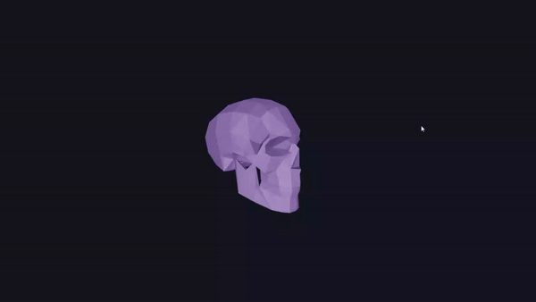

# 3D Oject Follows Cursor

   

### Overview

This repository contains an application built with React and Three.js. The main functionality revolves around a 3D model (a skull in this case) that reacts to user interactions and smoothly transitions between predefined and mouse-based orientations.

    

### Technologies Used

- React

- Three.js

- Framer Motion

- React Router Dom

### Clone the repository.

Install dependencies using `npm install`.

Use the provided development scripts 

`npm run dev`

`npm run build`

`npm run preview`

### [Website](https://3d-object-follows-cursor.netlify.app/)

